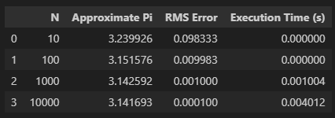
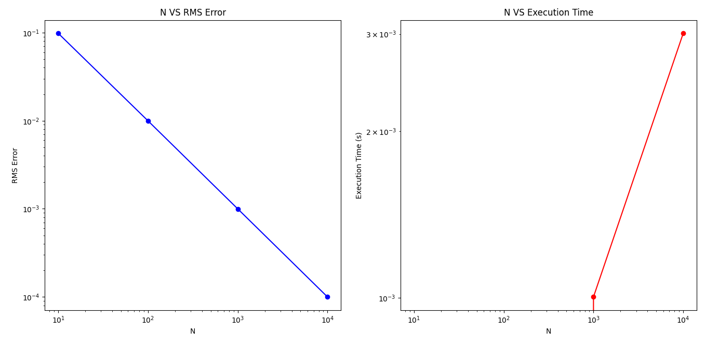

# Implementasi Integrasi Numerik
Program ini adalah sebuah program yang digunakan untuk impelemtasi integrasi numerik dengan metode integrasi ***Reimann***

## Panduan File dan Direktori

Pada repositori ini terdapat beberapa file serta direktori, ada beberapa hal yang perlu diketahui, yaitu:
* Pada direktori ***assets*** digunakan untuk menyimpan hasil program dalam bentuk csv.
* File ***main.py*** adalah file program utama dalam bahasa python yang digunakan untuk impelementasi
* File ***implementasi_integrasi.ipynb*** adalah file jupyter notebook yang isi programnya sama seperti ***main.py*** akan tetapi dalam format jupyter notebook **(Direkomendasikan menggunakan file ini)**
* Sebelum menjalankan program, pastikan terdapat Library ***Numpy***, ***pandas***, ***time***, ***matplotlib***, dan ***csv*** dikarenakan program ini menggunakan library tersebut.

## Testing
### Problem
Nilai pi dapat dihitung secara numerik dengan mencari nilai integral dari fungsi f(x) = 4 / (1 + x^2) dari 0 sampai 1.

Hitunglah nilai pi dengan menggunakan metode integrasi Reimann dengan ketentuan :
* Menggunakan variasi nilai ***N*** = 10, 100, 1000, 10000
* Hitung galat RMSnya
* Hitung waktu eksekusi dari tiap variasi ***N***
* Nilai referensi pi yang digunakan adalah **3.14159265358979323846**

### Hasil
Hasil yang dipoleh oleh dapat dilihat pada tabel dibawah : 

Grafik hubungan antara N dengan RMS dan N dengan Execution Time
